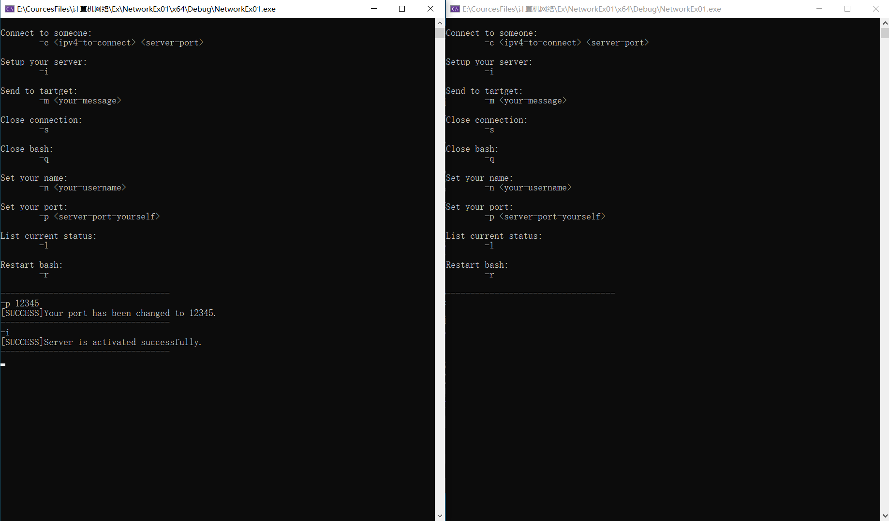

# 计算机网络第一次实验报告
## 孙博言 2011756

## [概要]
本次实验作业已完成所有基本实验要求，包括：
1. 使用流式Socket，设计了一个两人聊天协议，且聊天信息带有时间标签。

2. 完整地说明了交互消息的类型、语法、语义、时序等具体的消息处理方式。

3. 完成了对模块划分、模块功能的说明和模块的流程图。

4. 开发平台为Visual Studio 2022，在Windows系统下，利用C/C++对设计的程序进行了实现。使用了基本的Socket函数，没有使用对socket封装后的类或架构。

5. 测试了完整的流程，并且完成了实验报告。

## [协议]
本聊天程序在TCP流式通讯的基础上，设计了简单的应用协议，包括如下部分。

### 1. 消息类型

+ 对话消息，用于向已经建立连接的对方发送对话内容。
+ 更名消息，用于在更改当前用户名时，向已经建立连接的对方发送新用户名。
+ 断开消息，用于向已经建立连接的对方发送本机以下线。
+ 结束消息，用于回复断开消息，保证双方都完全断开并清理。

### 2. 消息语法

+ 对话消息，以`'#'`开头，后接一行对话内容，空格，制表符和换行符视为结尾。消息长度不能超过500个字符。在`'\0'`后接一`'^'`，再接时间戳信息。时间戳以`YYYY/MM/DD HH:mm:ss`格式表示发送消息时的系统时间。
+ 更名消息，以`'@'`开头，后接用户名，空格，制表符和换行符视为结尾。用户名长度不能超过100个字符。
+ 断开消息，以`'$'`开头，以`'\0'`结尾。
+ 结束消息，以`'%'`开头，以`'\0'`结尾。

### 3. 消息时序

连接双方的发送消息和接受消息两个过程异步进行，互相不受干扰。

在断开连接流程开启后，双方处理步骤如下。假如服务端请求断开：

1)  服务端向客户端发送`'$\0'`字符串，并检测发送结果。如果发送失败，视为连接异常。发送成功，服务端阻塞2秒，等待客户端进行处理，进入下一步。

2)  客户端接收到`'$\0'`字符串之后，向服务端回复`'%\0'`字符串。如果回复失败，视为异常。回复成功，启动客户端的断开和清理流程。

3)  服务端接收到客户端的回复，启动断开和清理流程。如果未收到回复，视为异常。

4)  断开和清理流程执行完毕后，双方均可重新建立连接，不受之前操作影响。

5)  本程序中对于连接异常的处理，一般忽略结果，可采用继续运行，重新建立连接，重新初始化客户端/服务器，重新启动bash或者退出程序等方式。

## [程序设计]

### 1. 模块说明

1) 程序入口(主函数`main`)

   在程序启动时，首先打印欢迎和帮助信息，介绍程序的使用方式。之后进入一个循环，循环中调用命令行程序(函数`bash`)，满足重启要求。

2) 命令行程序(函数`bash`)

   命令行程序，存放着与用户设置信息有关的局部变量。用户交互方式为键盘循环输入。用户使用时需要按照格式要求输入单条指令，程序具备基本的命令识别功能，命令格式如下：

| **命令开头标识** | **参数**             | **功能**    | **说明**                                |
|------------|--------------------|-----------|----------------------------------------|
| `-n`         | `<name> `            |  设置用户名    | 若输入无效则为默认用户名`Alice`，若已建立连接则会隐式发送消息通知对方 |
| `-l`         |                    | 打印当前状态    | 包括一些状态信息                               |
| `-p`         | `<port>`             | 设置主机服务端口  | 若输入无效则为默认端口`27015`，若服务已启动则会重启服务端。      |
| `-i`         |                    | 启动服务端     | 若服务已启动并不会重新启动                          |
| `-c`         | `<ip>` `<target-port>` | 向服务端寻求连接  | 若客户端/服务端已连接则无效，输入信息错误也无效。              |
| `-m`         | `<message>`          | 向对方发送对话信息 | 对话信息应小于最大长度，并不包含制表符，空格，换行符等占位符         |
| `-s`         |                    | 断开连接      | 隐式发送消息，执行过程参照时序设计                      |
| `-q`         |                    | 强制退出      | 会强行断开连接                                |
| `-r`         |                    | 重启bash    | 会强行断开连接                                |

  3) 服务端模块(类Server)

	 将运行的各个步骤进行了划分和封装。具备服务端创建，地址绑定，监听连接请求，异步监听客户端消息并处理，发送消息，关闭服务端等功能。同时具备一定的异常处理机制。

  4) 客户端模块(类Client)

     将运行的各个步骤进行了划分和封装。具备客户端创建，向服务端发送连接请求，异步监听服务端消息并处理，发送消息，关闭客户端等功能。同时具备一定的异常处理机制。

### 2. 模块流程图

由于细节过多，部分无关内容已省略。

## [程序测试]

### 0. 启动两个程序

### 1. 端口指定，服务器的建立

### 2. 用户名修改，客户端请求连接

### 3. 基本通信

### 4. 断开连接

### 5. 重新连接，交换角色

### 6. 退出

## [仓库地址]

[超链接](https://github.com/NKUSunBoyan/NetworkEx01 "仓库主页")

